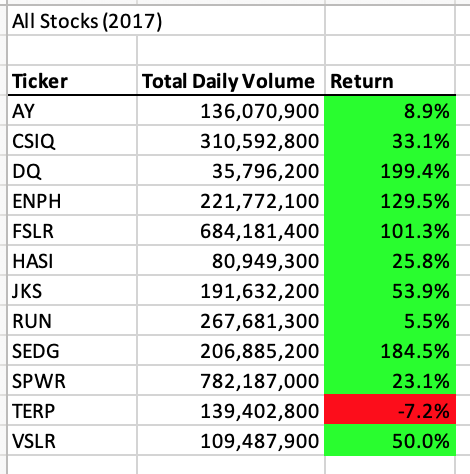
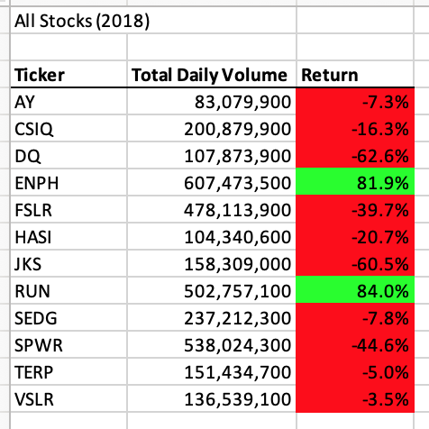
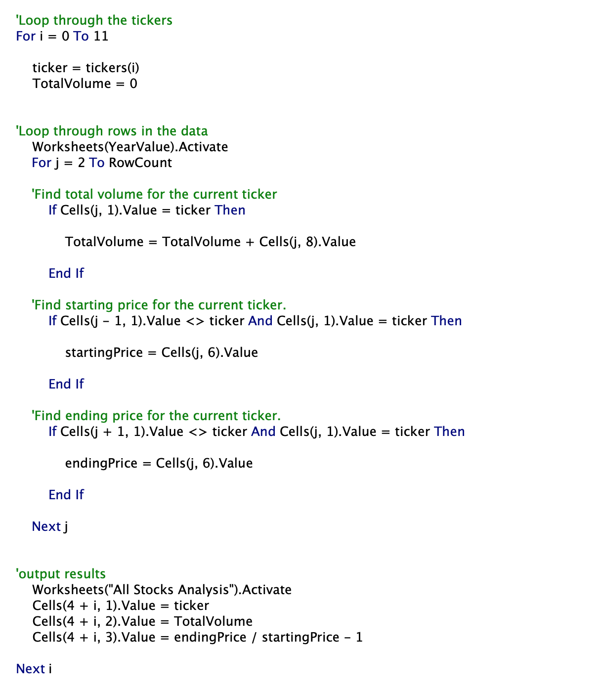
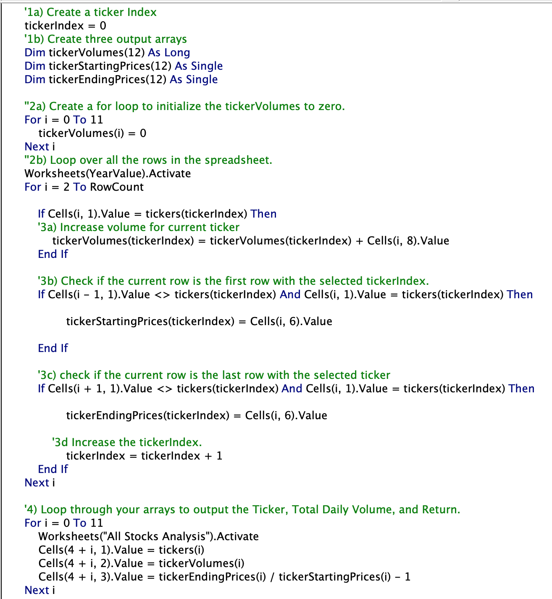

# Stock-Analysis
Stock analysis using VBA

## Overview of Project
Steve and his parents are about to invest in green energy stocks. In this project, we will using VBA tool to analysis the stocks data and determine their daily volume and yearly returns in 2017 and 2018. Throughout this project, we will compare the refactored code and original code to see if the refactored code improve the code performance. By completing this project, I would learn the use of arrays, nested loop, and conditional formarting in VBA script.

## Results
### Stock Analysis Results 
In 2017, except for TERP, all other stocks had a positive returns. Among the 12 stocks, DQ achieved the highest yearly returns with 199.4%. Where RUN gained the lowest positive return with 5.5%.

\
Figure 1: the daily volume and yearly returns of all stocks in 2017.

\
Figure 2: the daily volume and yearly returns of all stocks in 2018.

### Original Code Vs Refactored Code

Figure 3: the original code.

Figure 4: the Refactored code.

## Summary

### Advantages
1. Reducing code run time

### Disadvantages
1. Time consuming

